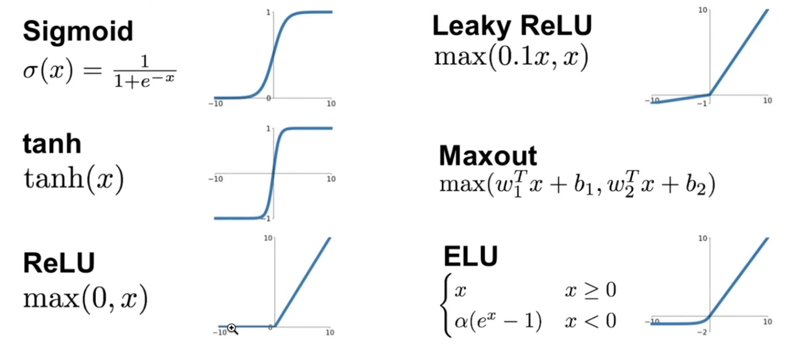
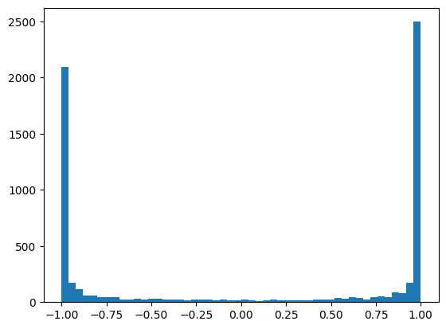
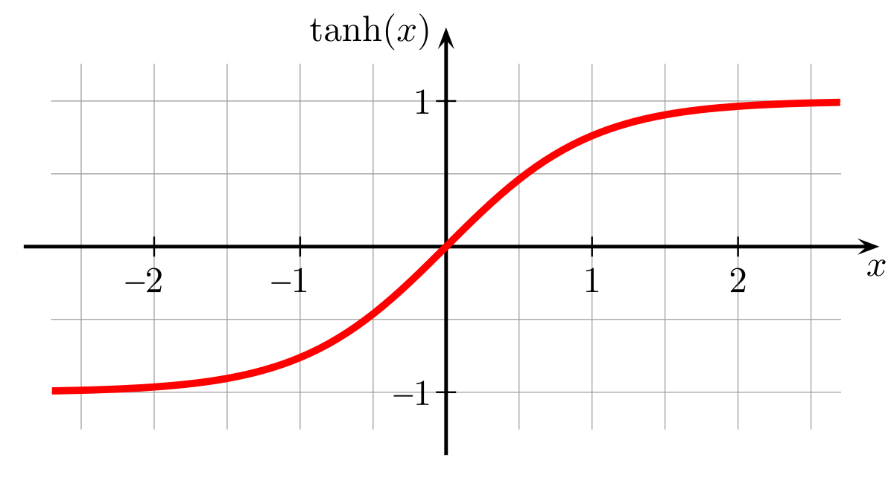

## Part 3: Activations & Gradients, BatchNorm

At the initialization itself you have an idea what loss to expect based on loss function and problem setup. 

Example:
- In the character-level model, we have 27 possible character
- At the time of initialization, all 27 chars should be around equally possible (`1/27.0`)
- We calculate loss by taking log of probability = `log(1/27.0)` ~ 3.2
- So our gradient descend should start from the loss value of 3.2

In reality, it started with ~25, which is very high. So many iterations of gradient descent wasted initially.

The random initialization in the example results in logits with extreme values, messing up the predictions.

We want the logits to be rougly 0 when the network is initialized. They just don't have to be zero, but approximately equal. 

Logits are derived by multiplying hidden layer output by `W2` and adding `b2`. To bring the values of logits closer to zero, we can do following:
- Reduce what is being added to logits (b2 * 0) - by multiplying it with 0
- Multiply logits by a very small number, say 0.01 to bring the result closer to 0. 

```python
W2 = torch.randn(n_hidden, vocab_size) * 0.01
b2 = torch.randn(vocab_size) * 0
```

loss = 2.069702386856079 after 60000 iterations 

## Activation problems

There are three types of activation functions: binary, linear & non-linear. 

In non-linear functions, results that are not proportional to the input. Examples are: sigmoid function, Tanh, ReLU and ELUs

**Different activation functions**

1. Sigmoid
2. tanh
3. ReLU
4. Leaky ReLU
5. Maxout
6. ELU



The activation function for your output layer is determined by the sort of prediction issue you’re solving. These are some ground guidelines to remember:

- Regression — Linear Activation Function
- Binary Classification — Sigmoid/Logistic Activation Function
- Multiclass Classification — Softmax
- Multilabel Classification — Sigmoid

Based on neural-network architectue:
- Convolutional Neural Network (CNN): ReLU activation function.
- Recurrent Neural Network: Tanh and/or Sigmoid activation function.


Imagine a tanh neuron. If all the outputs are close to 1 or close to -1, then  it is squashing the weights and suppressing lot of meaning in the hidden data. 



If the output of tanh is skewed towards 1 and -1 (as shown in the graph above), then during backpropagation, gradient is almost always equals to zero. That means there is no or very little influence of weights and biases on the gradient in backpropagation. It is pushed to 0s. This is known as **vanishing gradient problem**

```python
def tanh(self):
    x = self.data
    t = (math.exp(2*x) - 1) / (math.exp(2*x) + 1) # tanh(x) is calculated here
    out = Value(t, children=(self, ), _op='tanh')
    
    def _backprop():
        self.grad += (1 - t ** 2) * out.grad # Pay attention here
    out._backprop = _backprop
    return out
```

To fix this, we need the input of tanh, i.e. hpreact, to be closer to 0:
```python
embs = C[Xb]
embcat = embs.view(-1, block_size * n_embd)
hpreact = embcat @ W1 + b1
h = torch.tanh(hpreact)
```

We can multiply W1, b1 by a factor of 0.1 or something. This will bring hpreact closer to 0.



When all examples give 0 gradient out on tanh, then it is called *dead neuron* - this neuron will never learn.

**Kaiming init**
We know we need to fix initialization, but by how much value we multiply weights and biases?
Kaiming normalize initialization: in pytorch `torch.nn.init.kaiming_normal_`

We want the neural network to have relatively simple activations, so we want unit gaussian throughout the network.

In practice, just normalizing (dividing) by square root of fan-in is enough. Kaiming normalization for tanh: `(5/3)*(fan_in**0.5)`

Game in front of activation. 

Standard deviation

`sqrt(x) = x ** 0.5`

### Batch Normalizarion
2015 Google paper

**Standard deviation** measures how spread out numbers in a data set are from their average (mean).

Batch Normalization basically says, why don’t we just take the hidden states and normalize them to be gaussian. This will give us uniform gaussian at initialization. These values are then fed in tanh and solves vanishing gradient problem.

We want the neural network to be able to move the distribution and scale it. So we introduce one more component called scale and shift.


More techniques: layer normalization, group normalization

Saturation stabilizes around 5% dur to 5/3 gain. 5/3 is a good setting for Linear+Tanh stacking. 5/3 maybe comes from Kaiming initialization for Tanh. Reference of Pytorch: [here](https://docs.pytorch.org/docs/stable/nn.init.html)

Why do we need Tanh layers at all?
Because having just multiple Linear layers collapses into a single Linear layer in terms of presentation. Forward pass collapses. 

Weight-Gradient Distribution on Parameters:
- Grad:data ratio gives us an intuition of what is the scale of the gradient compared to the actual values. 
- This is important because we will be taking a step update of the form `w = w - lr * grad`.
- In last layer, grad:data ratio is around 2.0. That means gradients are much higher than some of the values inside the data. 

Update to data ratio:
- The ratio of update of t

With batch normalization introduced, we may not have to normalize weights with the fan in too. Batch will still be well behaved. 

### Resources
1. https://bedirtapkan.com/posts/blog_posts/karpathy_3_makemore_activations/
2. https://karpathy.github.io/2019/04/25/recipe/
3. Backprop basics & maths: https://github.com/ADGEfficiency/teaching-monolith/blob/master/backprop/intro-to-backprop.ipynb
4. 